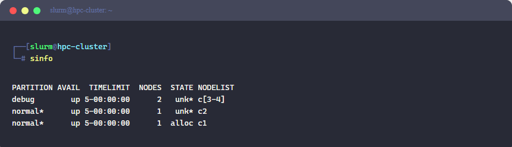
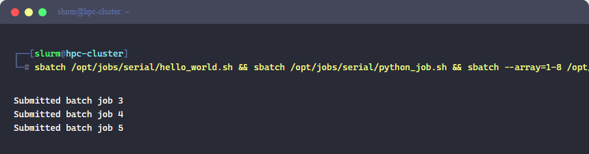
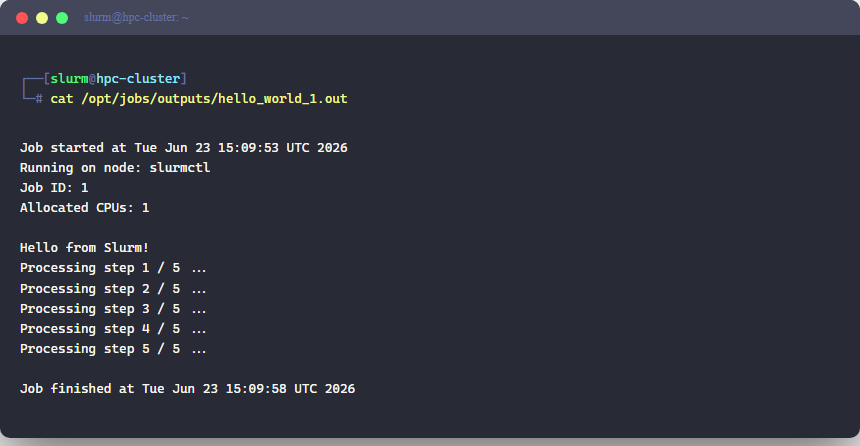
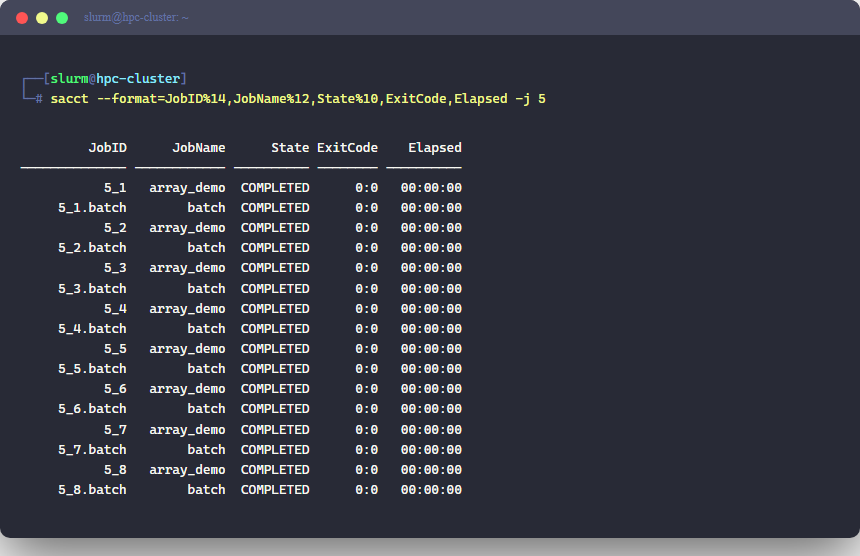
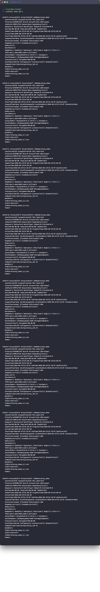

# slurm-job-templates

A reference collection of production-ready Slurm batch scripts covering every common HPC job type — serial, job arrays, shared-memory (OpenMP), distributed-memory (MPI), and GPU. All scripts were tested on a local Slurm 21.08 cluster running four nodes with two partitions (`normal` and `debug`).

## Environment

| Component | Version |
|---|---|
| Slurm | 21.08.0 |
| Nodes | 4 (c1–c4), 2 partitions |
| Scheduler | `normal` (default) · `debug` (GPU) |

## Cluster status



## Job types

### Serial jobs (`serial/`)

**`hello_world.sh`** — minimal batch script covering the core `#SBATCH` directives every job needs.

```bash
#SBATCH --job-name=hello_world
#SBATCH --ntasks=1
#SBATCH --cpus-per-task=1
#SBATCH --mem=256M
#SBATCH --time=00:05:00
#SBATCH --partition=normal
```

**`python_job.sh`** — runs a Python Monte Carlo π estimate inside a batch job. Shows how to embed a Python heredoc inside a batch script without creating a separate `.py` file.

#### Submitting the jobs



#### Job output — hello_world



#### Job output — Monte Carlo Pi


---

### Job arrays (`arrays/`)

Job arrays are the standard way to run the same code across many input values without submitting dozens of separate jobs. Slurm tracks them as a single entity (`ARRAY_JOB_ID_TASK_INDEX`).

**`array_job.sh`** — launches 8 independent tasks (`--array=1-8`). Each task reads its index from `$SLURM_ARRAY_TASK_ID` and computes a distinct value.

```bash
#SBATCH --array=1-8
#SBATCH --ntasks=1
#SBATCH --cpus-per-task=1
```

**`array_with_params.sh`** — reads a `params.txt` file line by line, using the task index as a row selector. Useful for hyperparameter sweeps where each line is a distinct configuration (learning rate, batch size, epochs).

```
# params.txt — one config per line
0.001 32  50
0.001 64  50
0.01  32  30
0.01  64  30
0.1   32  20
```

#### sacct — all 8 array tasks completed



---

### OpenMP (`parallel/openmp_job.sh`)

Single-node, multi-threaded jobs. Key directive is `--cpus-per-task` — Slurm allocates the cores and you set `OMP_NUM_THREADS` to match.

```bash
#SBATCH --ntasks=1
#SBATCH --cpus-per-task=4
export OMP_NUM_THREADS=$SLURM_CPUS_PER_TASK
```

The script compiles a C program with `-fopenmp`, runs a parallel π approximation using a reduction clause, and cleans up the binary after.

---

### MPI (`parallel/mpi_job.sh`)

Distributed-memory jobs span multiple nodes. `srun` is used instead of `mpirun` because it is Slurm-native and respects the resource allocation.

```bash
#SBATCH --ntasks=8
#SBATCH --ntasks-per-node=4    # 2 nodes × 4 ranks each
srun /tmp/mpi_binary
```

The example computes a distributed harmonic series sum: each rank handles a contiguous slice of `1..N`, and `MPI_Reduce` collects the partial sums on rank 0.

---

### GPU (`gpu/gpu_job.sh`)

GPU jobs request resources with `--gres=gpu:1` and target the `debug` partition (where GPU nodes live).

```bash
#SBATCH --gres=gpu:1
#SBATCH --partition=debug
```

The script runs `nvidia-smi` to confirm the allocation, then benchmarks matrix multiplication with PyTorch and reports TFLOPS throughput.

---

## Inspecting a completed job

```bash
# Full job detail
scontrol show job <JOBID>

# Resource efficiency (CPU time, memory)
sacct --format=JobID,JobName,State,ExitCode,Elapsed,MaxRSS -j <JOBID>
```



## Key Slurm environment variables

| Variable | Meaning |
|---|---|
| `$SLURM_JOB_ID` | Unique job ID |
| `$SLURM_ARRAY_JOB_ID` | Master ID of an array job |
| `$SLURM_ARRAY_TASK_ID` | Index of this array task |
| `$SLURM_CPUS_PER_TASK` | CPUs allocated (use for OMP threads) |
| `$SLURM_NTASKS` | Total MPI ranks allocated |
| `$SLURM_JOB_NODELIST` | Comma-expanded list of assigned nodes |
| `$SLURM_JOB_NUM_NODES` | Number of nodes in the allocation |
| `$SLURM_MEM_PER_NODE` | Memory (MB) allocated per node |
